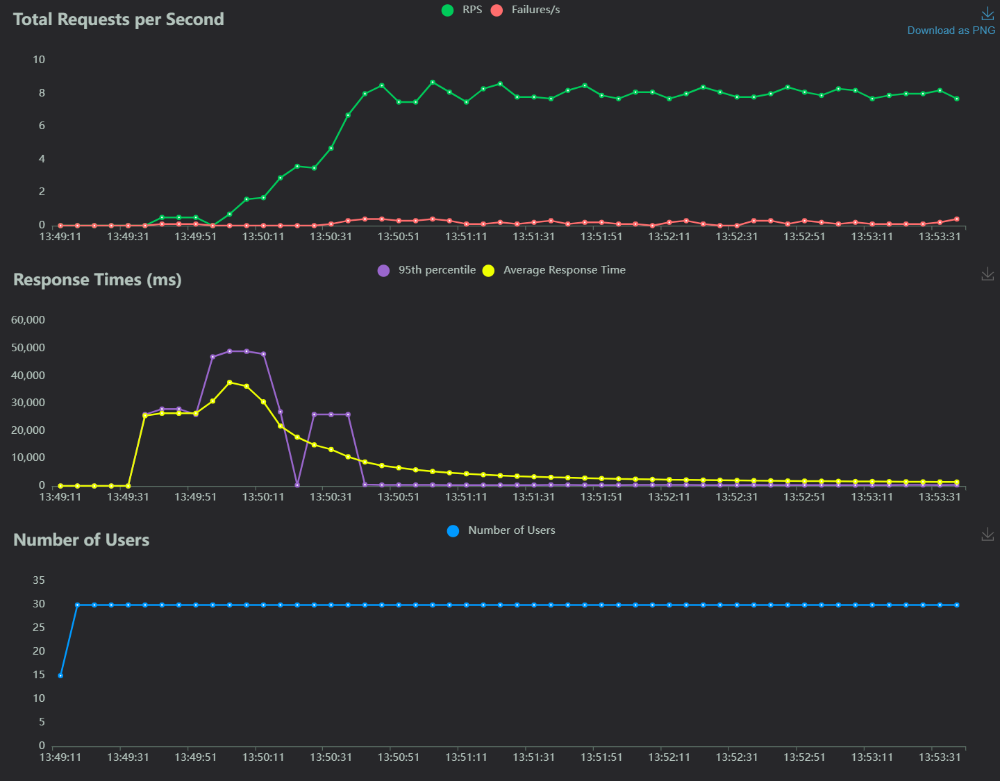
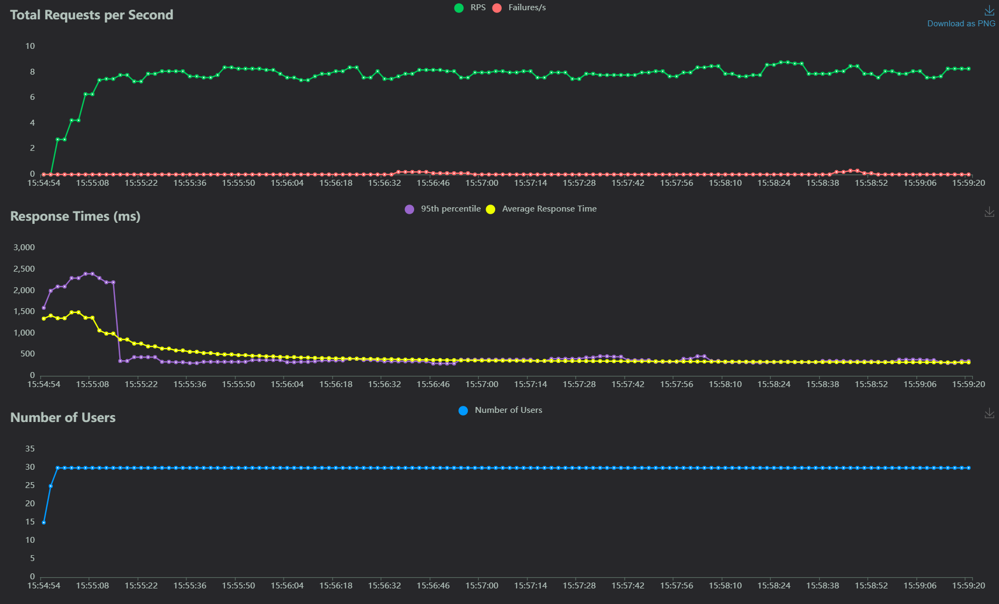
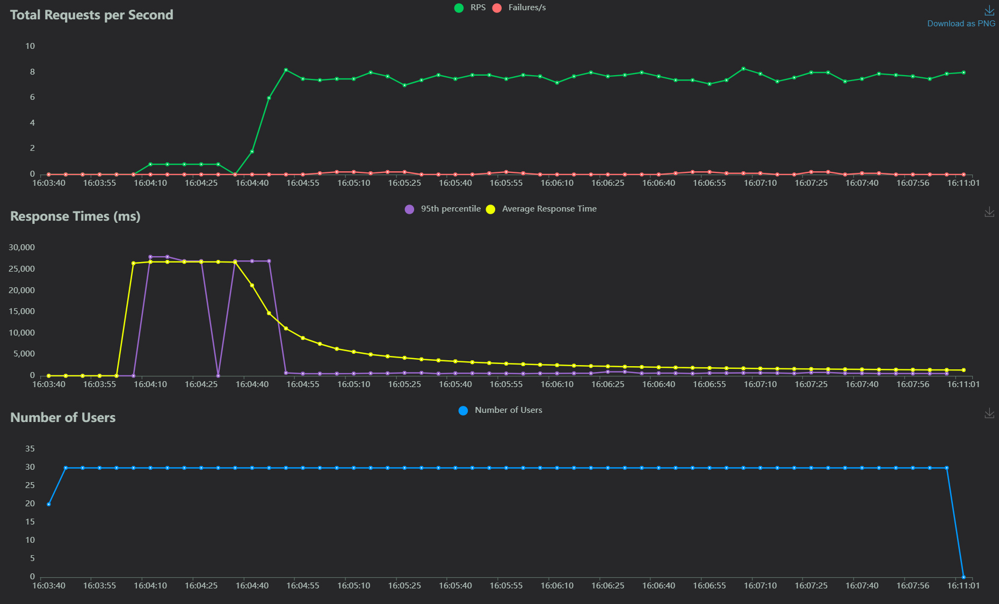
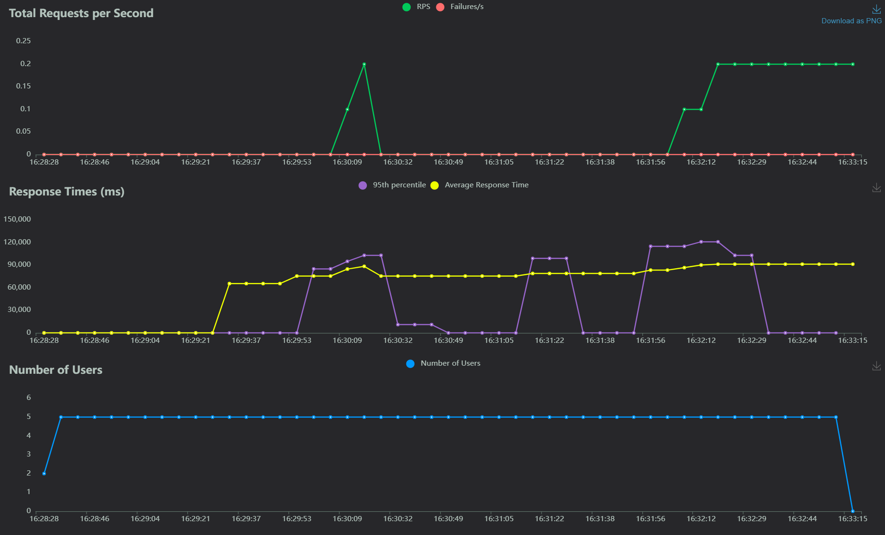
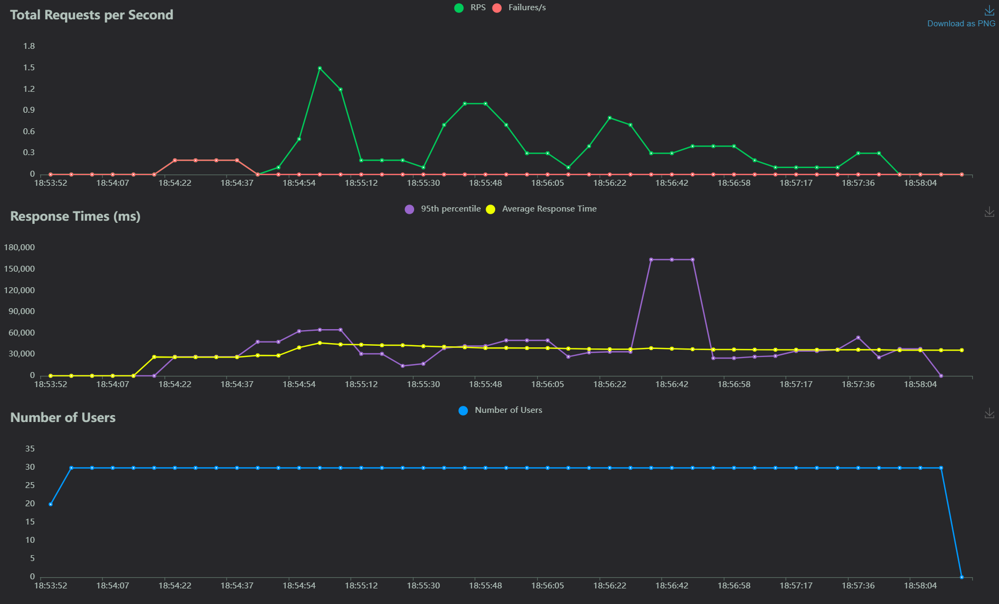
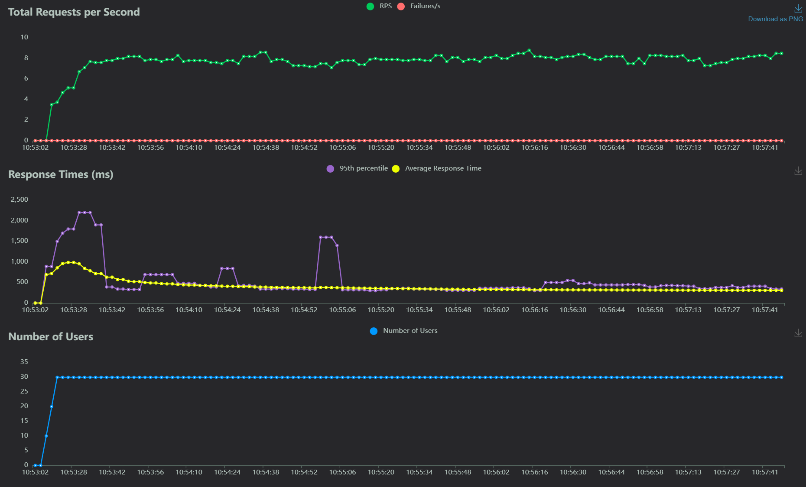
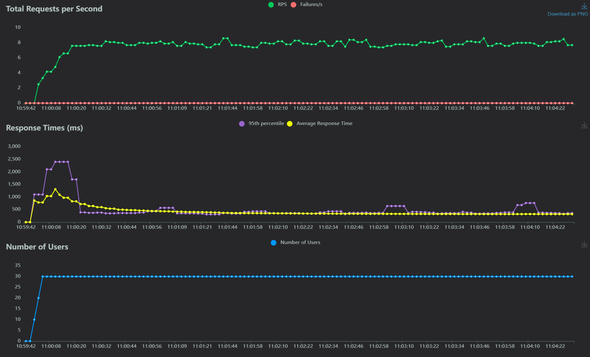
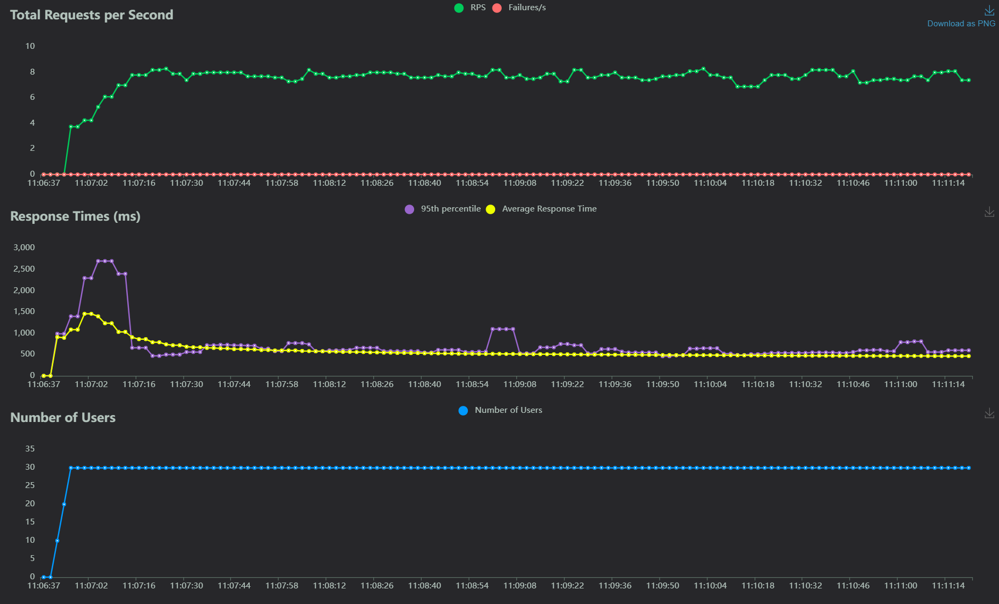
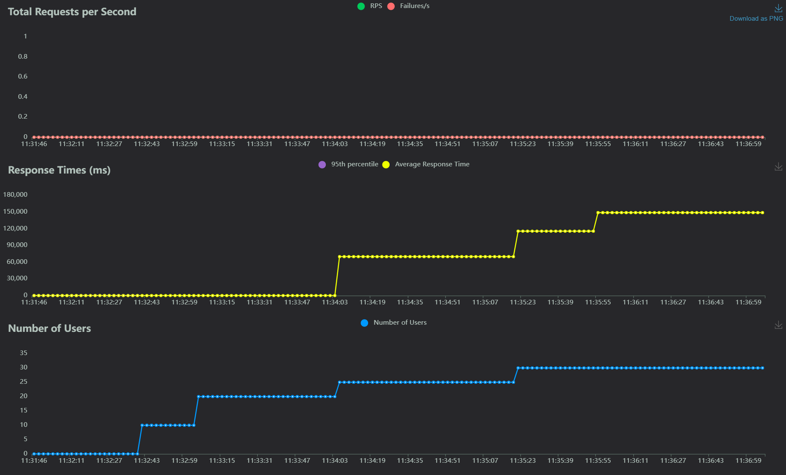
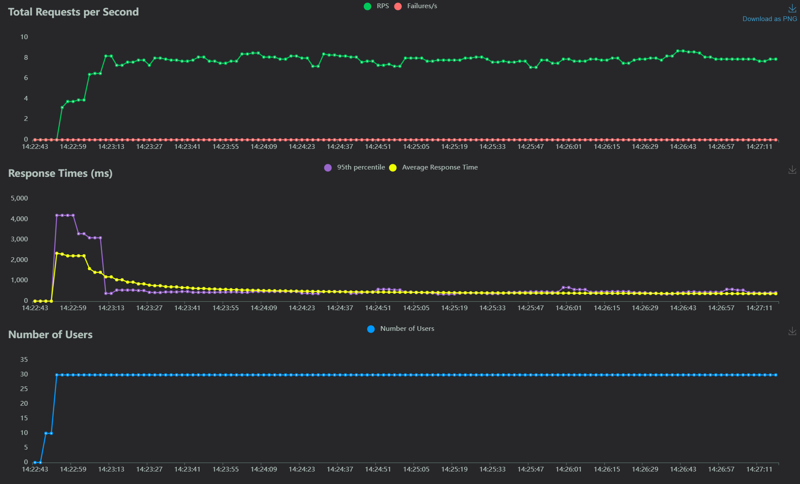

# Report for the Cloud Computing Assignment.

## Introduction

I used Nextcloud to deploy a local cloud solution using Docker containers. The configuration includes two `Nextcoud` instances with a shared data volume and independet (although identical) configuration files to achieve high reliability, a `MySQL` container as a database, a `Redis` container to implement caching and a `Nginx` container as a reverse proxy and to perform load balancing.  
Moreover, a `Locust` container was added to perform load testing.  

The system allows users to sign up, log in, and log out using the integrated Nextcloud UI, thanks to the module Register that can be installed and integrated through the Nextcloud native GUI.  

It is possible to configure roles for new users, such as admin, a user, and a guest, but more roles can be added as needed through the integrated functionality for user management, including having asymmetrical access to resources and functionalities.  

Each user has their own private storage space, which can only be accessed by them or by directly accessing the machine and locating the directories associated with the user. This can be either considered a feature for better control by the sysadmins on how the service is used, or it can be seen as a vulnerability depending on the context. If this is considered a sceurity issue, it could be mitigated by activating the built in encryption method, which makes the files still accessible to the admins but it prevents the content to be read by anyone but the owner of the file. It is possible to configure different maximum upload and storage size limits for each user.  

The project can be scaled by adding more instances running on different machines by configuring the nginx and redis instances accordingly, while the storage can be scaled by implementing the appropriate object filesystem, but even a basic such implementation requires at least 2 disks to work properly, so I wasn't able to implement it on my single disk machine.  

It is possible to implement https:// encryption by using a reverse proxy such as nginx or Apache, by acquiring an SSL certificate for a hostname and configuring the appropriate virtual host; this would allow for secure data and file transmissions.  

User authentication can be further secured by using the built in tools to activate 2FA and other security measures.  

The platform used for this project is Docker Desktop running on WSL2 in a Windows 11 Pro machine equipped with an Intel i5 1340P CPU (4+8 cores), 32 GB of DDR4 memory and a 2TB NVMe PCIe 4.0 SSD.  

Monitoring and managing the system can be achieved directly through the GUI, since systems to do most of the required tasks are either already present or can be easily integrated through the Apps section of the GUI of Nextcloud, including an email server that can be automatized to send reports of unusual activity, high resource usage and regular reports.  

## Deployment Plan

### The Docker Compose file

The deployment plan for the cloud-based file storage system is handled in a docker-compose.yml file, which is included below.  
It requires Docker and the creation of the correct directories where to place the required volumes.

```yaml
version: '3.8'

services:

  nextcloud-db:
    image: mysql:latest
    container_name: nextcloud-db
    environment:
      MYSQL_ROOT_PASSWORD: your-root-password
      MYSQL_DATABASE: nextcloud
      MYSQL_USER: nextcloud
      MYSQL_PASSWORD: your-user-password
    restart: always
    volumes:
      - ./db:/var/lib/mysql
    networks:
      - nextcloud-network

  redis:
    image: redis:alpine
    container_name: nextcloud_redis
    networks:
      - nextcloud-network

  nextcloud_instance:
    image: nextcloud:latest
    container_name: nextcloud_instance
    depends_on:
      - nextcloud-db
    ports:
      - "8080:80"
    volumes:
      - ./data:/var/www/html/data
      - ./config:/var/www/html/config
      - ./apps:/var/www/html/custom_apps
    environment:
      - REDIS_HOST=redis
    networks:
      - nextcloud-network

  nextcloud_instance1:
    image: nextcloud:latest
    container_name: nextcloud_instance1
    depends_on:
      - nextcloud-db
    ports:
      - "8081:80"
    volumes:
      - ./data:/var/www/html/data
      - ./config1:/var/www/html/config
      - ./apps1:/var/www/html/custom_apps
    environment:
      - REDIS_HOST=redis
    networks:
      - nextcloud-network

  locust:
    image: locustio/locust
    ports:
      - "8089:8089"
    volumes:
      - ./locust:/mnt/
    command: -f /mnt/locustfile.py --host http://nextcloud_nginx:80 --users 30 --spawn-rate 5 -t 4m30s
    networks:
      - nextcloud-network

  nginx:
      image: nginx:latest
      container_name: nextcloud_nginx
      ports:
        - "80:80"
      volumes:
        - ./nginx.conf:/etc/nginx/nginx.conf:ro
      depends_on:
        - nextcloud_instance
        - nextcloud_instance1
      networks:
        - nextcloud-network

networks:
  nextcloud-network:
    driver: bridge
```

### Breakdown of the docker compose file

Here's the breakdown of the docker compose file:

* nextcloud-db: This is the MySQL database container that will store the Nextcloud data. It is configured with a root password, database name, user, and password. It is configured to restart always and has a volume mounted to store the database data, placed in the specified directory in the host machine.. It is part of the nextcloud-network, so that it can communicate with the other conatiners in the network.  

```yaml
  nextcloud-db:
    image: mysql:latest
    container_name: nextcloud-db
    environment:
      MYSQL_ROOT_PASSWORD: your-root-password
      MYSQL_DATABASE: nextcloud
      MYSQL_USER: nextcloud
      MYSQL_PASSWORD: your-user-password
    restart: always
    volumes:
      - ./db:/var/lib/mysql
    networks:
      - nextcloud-network
```

* redis: This is the Redis container that will be used for caching in Nextcloud. It is configured to be part of the nextcloud-network, while the configuration is not specified and it will thus sue the default values for everything.  

```yaml
  redis:
    image: redis:alpine
    container_name: nextcloud_redis
    networks:
      - nextcloud-network
```

* nextcloud instances: these two containers are the Nextcloud instances. They are configured to have identical but independent application and configuration files, for increased durability, while the data volume they operate on is the same. They are configured to be part of the nextcloud-network, and depend on the nextcloud-db and redis containers.  

```yaml
  nextcloud_instance:
    image: nextcloud:latest
    container_name: nextcloud_instance
    depends_on:
      - nextcloud-db
    ports:
      - "8080:80"
    volumes:
      - ./data:/var/www/html/data
      - ./config:/var/www/html/config
      - ./apps:/var/www/html/custom_apps
    environment:
      - REDIS_HOST=redis
    networks:
      - nextcloud-network

  nextcloud_instance1:
    image: nextcloud:latest
    container_name: nextcloud_instance1
    depends_on:
      - nextcloud-db
    ports:
      - "8081:80"
    volumes:
      - ./data:/var/www/html/data
      - ./config1:/var/www/html/config
      - ./apps1:/var/www/html/custom_apps
    environment:
      - REDIS_HOST=redis
    networks:
      - nextcloud-network
```

* locust: This is the Locust container that will be used to generate load on the Nextcloud instances. It is used for testing purposes only and it requires some extra care to work properly, like the deactivation of some security measures in the nexcloud instances and the presence of a locustfile.py file, which will be discussed in a later section. The docker compose file defines the default values for the host, users, spawn rate, and test duration. The locust container is configured to be part of the nextcloud-network.  

```yaml
  locust:
    image: locustio/locust
    ports:
      - "8089:8089"
    volumes:
      - ./locust:/mnt/
    command: -f /mnt/locustfile.py --host http://nextcloud_nginx:80 --users 30 --spawn-rate 5 -t 4m30s
    networks:
      - nextcloud-network
```

* nginx: This is the Nginx container that will be used to serve the Nextcloud instances. It requires a configuration file called nginx.conf, which will discussed in a later section as well. It depends on the nextcloud_instance and nextcloud_instance1 containers, for which it provides the access interface and the load balancing between them through the redis container to distribute the load. It is also configured to be part of the nextcloud-network.

```yaml
  nginx:
      image: nginx:latest
      container_name: nextcloud_nginx
      ports:
        - "80:80"
      volumes:
        - ./nginx.conf:/etc/nginx/nginx.conf:ro
      depends_on:
        - nextcloud_instance
        - nextcloud_instance1
      networks:
        - nextcloud-network
```

* networks: This section defines the network that will be used by all the containers.

``` yaml
networks:
  nextcloud-network:
    driver: bridge
```

## Redis and nginx configuration

The configuration of nginx and redis is handled by the `docker-compose` and by the `nginx.conf` file.

### nginx.conf configuration file

The `nginx.conf` file is reported below. In it, I specify:

* The way the container should handle resources. By setting it to auto, it will automatically parallelize the jobs;  
* The http configuration, which is itself divided into chunks:  
  * upstream defines the way the backend should behave, by providing the load balancing algoithm (`least_conn`: new requests will be handled by the instance with the least connections) and the addresses of the instances.  
  * log format defines which information to include in the logs, in this case upstream information; this is unnecessary but can be useful for debugging;  
  * The server configures the port to use, the reverseproxy and other connection parameters.

```nginx
worker_processes auto;

events {}

http {
    upstream nextcloud_backend {
        least_conn;
        server nextcloud_instance:80;
        server nextcloud_instance1:80;
    }

    # Define the log format with upstream information
    log_format upstreamlog '$remote_addr - $remote_user [$time_local] "$request" '
                           'upstream_response_time $upstream_response_time msec $msec request_time $request_time '
                           'upstream_addr $upstream_addr upstream_status $upstream_status';

    server {
        listen 80;
        server_name localhost;

        # Use the defined log format for access logs
        access_log /var/log/nginx/access.log upstreamlog;

        location / {
            proxy_pass http://nextcloud_backend;
            proxy_set_header Host $host;
            proxy_set_header X-Real-IP $remote_addr;
            proxy_set_header X-Forwarded-For $proxy_add_x_forwarded_for;
            proxy_set_header X-Forwarded-Proto $scheme;
            client_max_body_size 0; # Zero means no limit
        }

        # Nginx status page configuration
        location /nginx_status {
            stub_status on;
            allow 127.0.0.1;        # Only allow access from localhost
            allow 172.23.0.0/16;    # Allow access from the Docker network
            deny all;               # Deny access to anyone else
        }
    }
}

```

## Load Testing

### Locustfile.py configuration file

The locust container requires a Python configuration file called locustfile.py. It is placed in the specified directory in the host machine and reported below.  
It defines the test users' credentials and the testing tasks: the uploading of a text files and dummy files of varying sizes. Each uploaded file is expected to be deleted after the upload as a part of the test and for cleanup purposes.  

```python
import random
from locust import HttpUser, task, between
from requests.auth import HTTPBasicAuth

class NextcloudUser(HttpUser):
    auth = None
    user_name = None
    wait_time = between(2, 5)

    # users to test this with.
    def on_start(self):
        user_idx = random.randrange(0, 30)
        self.user_name = f'locust_user{user_idx}'
        self.auth = HTTPBasicAuth(self.user_name, 'test_password1234!')
    
    # Upload txt files
    @task(10)
    def upload_file_text(self):
        with open("/mnt/test-data/test_locust_file.txt", "rb") as file:
            self.client.put(f"/remote.php/dav/files/{self.user_name}/test_locust_file.txt", data=file, auth=self.auth)
            self.client.delete(f"/remote.php/dav/files/{self.user_name}/test_locust_file.txt", data=file, auth=self.auth)
    
    # Upload big files
    @task(5)
    def upload_file_1gb(self):
        remote_path = f"/remote.php/dav/files/{self.user_name}/1gb_file_{random.randrange(0, 10)}"
        with open("/mnt/test-data/file_1gb", "rb") as file:
            self.client.put(remote_path, data=file, auth=self.auth)
            # self.client.delete(remote_path, data=file, auth=self.auth)

    # Upload small files
    @task(10)
    def upload_file_1kb(self):
        remote_path = f"/remote.php/dav/files/{self.user_name}/1kb_file_{random.randrange(0, 10)}"
        with open("/mnt/test-data/file_1kb", "rb") as file:
            self.client.put(remote_path, data=file, auth=self.auth)
            self.client.delete(remote_path, data=file, auth=self.auth)

    # Upload medium files
    @task(10)
    def upload_file_1mb(self):
        remote_path = f"/remote.php/dav/files/{self.user_name}/1mb_file_{random.randrange(0, 10)}"
        with open("/mnt/test-data/file_1mb", "rb") as file:
            self.client.put(remote_path, data=file, auth=self.auth)
            self.client.delete(remote_path, data=file, auth=self.auth)
```

The test files have been generated in Ubuntu 22.04 LTS running on WSL using the following command:

```bash
dd if=/dev/urandom of=filename bs=1B count=appropriate_size_in_bytes
```

### User generation and cleanup

The test users have been generated using the following powershell script, setting the credentials according to the ones defined above. The script has been parallelized because it was very time consuming to run sequentially.  

```powershell
# PowerShell script to create multiple Nextcloud users via Docker in parallel

# Define base user name
$baseUserName = "locust_user"

# Define password to be used for all users
$password = "test_password1234!"

# Define the total number of users to create
$totalUsers = 30

# ScriptBlock for creating a single user
$scriptBlock = {
    param($userName, $password)
    
    # Command to create the user in the Nextcloud instance
    $cmd = "docker exec -e OC_PASS=$password --user www-data nextcloud_instance /var/www/html/occ user:add --password-from-env $userName"
    Invoke-Expression $cmd

    # Output the user name to the console
    Write-Host "Created user: $userName"
}

# Loop to create each user
for ($i = 0; $i -lt $totalUsers; $i++) {
    # Construct the user name
    $userName = "$baseUserName$i"

    # Start the job in the background
    Start-Job -ScriptBlock $scriptBlock -ArgumentList $userName, $password
}

# Wait for all jobs to complete
Get-Job | Wait-Job

# Display the results of the jobs
Get-Job | Receive-Job

# Clean up the jobs
Get-Job | Remove-Job
```

For cleanup purposes, I used another powershell script to delete all the users and files:

```powershell
# PowerShell script to delete multiple Nextcloud users via Docker in parallel

# Define base user name
$baseUserName = "locust_user"

# Define the total number of users to delete
$totalUsers = 30

# ScriptBlock that contains the code to delete a single user
$scriptBlock = {
    param($userName)
    
    # Command to delete the user in the Nextcloud instance
    $cmd = "docker exec --user www-data nextcloud_instance php /var/www/html/occ user:delete $userName"

    Invoke-Expression $cmd

    # Output the user name to the console
    Write-Host "Deleted user: $userName"
}

# Loop to delete each user
for ($i = 0; $i -lt $totalUsers; $i++) {
    # Construct the user name
    $userName = "$baseUserName$i"

    # Start the job in the background
    Start-Job -ScriptBlock $scriptBlock -ArgumentList $userName
}

# Wait for all jobs to complete
Get-Job | Wait-Job

# Display the results of the jobs
Get-Job | Receive-Job

# Clean up the jobs
Get-Job | Remove-Job
```

### Additional steps

To grant unrestricted access to the locust load tester, some security measures need to be taken off. For example, to grant it full access and bypass the built in security measures of both Nextcloud and nginx, the following command was run:

```shell
docker exec --user www-data nextcloud_instance php /var/www/html/occ config:system:set trusted_domains 2 --value=nextcloud_instance
docker exec --user www-data nextcloud_instance1 php /var/www/html/occ config:system:set trusted_domains 2 --value=nextcloud_instance1
docker exec --user www-data nextcloud_instance php /var/www/html/occ config:system:set trusted_domains 3 --value=nextcloud_nginx
docker exec --user www-data nextcloud_instance1 php /var/www/html/occ config:system:set trusted_domains 3 --value=nextcloud_nginx

```

while an edit to the `configure.php` file found in the `.\config` directory in the host filesystem was performed, by adding the following two lines to it:

```php
  'ratelimit.protection.enabled' => false,
  'filelocking.enabled' => false,
```

This way, the tests won't be considered as attacks and the connections won't be blocked, while at the same time the files will remain accessible.  

In prodcution all of these and other security measures should be implemented, but since this instance is running locally and it's only used for testing purposes, it's not a problem to disable them.  

### Results

The tests have been run with 30 users, by manually cycling through each test exclusively and then on a mix of all of them. Each test has been run for 30 users and both with just one instance and load balancing. The summary graphs are reported below.

#### One instance







As shown, the system performed about the same for each load, with some occasional failure. Despite the presence of a log of the encountered errors, it's hard to understand what's causing them. They sometimes seem to coincide with other background tasks starting, but not all of the time - sometimes there will be nothing going on and the task will still fail, while other times it won't fail even under additional load.  



On the contrary, the performance on big files is extremely poor, both in latency terms (average latency of 1 minute and 30 seconds on a disk capable of sustained sequential write 7 GB/s, 600 MB/s random write, 12 cores and 32 GB of fast memory is not acceptable, since each request should take between 1 and 3 seconds to process) and in requests per second. The reason for such unexpectedly low performance is almost surely to attribute to the Windows/WSL communication overhead. Contrary to the two instance case, the memory usage reported by task manager remained within manageable levels.  
To test this hypothesis I should run the same configuration in a native Linux system, but I don't have the time to do that.  



The presence of the big files and their problems is evident in the very inconsistent performance and response time chart.  

#### Two instances







The nominal performance by running the same loads on multiple instances is about the same, but the number of failures is 0, which is a big improvement.  



On the other hand, the response time for the big files climbs beyond the duration of the test, so no request has the chance to fail nor to succeed. The Windows reported RAM usage climbed to over 31 GB during this test,so it's possible that the system ran out of memory before being able to complete anything.



Seeing that trying to load with the 1 GB files completely broke the test, this time the mixed load test excludes the big file upload task, which result in a test that is no different from the first three: about the same performance but no failures at all.  
  
It seems that having more instances - even running on the same machine, sharing the same resources - provides better reliability, even if not better peroformance.  
